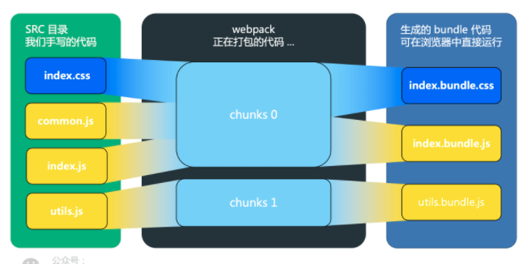

## 1. module, chunk, bundle的区别
其实三个都是同一个东西，只是在打包不同阶段的命名不同。
- Bundle
- Bundle是由多个不同的模块生成，bundles 包含了早已经过加载和编译的最终源文件版本。
**Bundle 分离（Bundle Splitting）:**这个流程提供了一个优化 build 的方法，允许 webpack 为应用程序生成多个 bundle。最终效果是，当其他某些 bundle 的改动时，彼此独立的另一些 bundle 都可以不受到影响，减少需要重新发布的代码量，因此由客户端重新下载并利用浏览器缓存。

- Module
- **模块（Module）**提供比较完整程序接触面（surface area）更小的离散功能块。精心编写的模块提供了可靠的抽象和封装界限，使得应用程序中每个模块都具有条理清楚的设计和明确的目的。
模块解析（Module Resolution）一个模块可以作为另一个模块的依赖模块，resolver 是一个库（libary）用于帮助找不到模块的绝对路径，模块将在resolve.modules中指定的所有目录内搜索。

- Chunk
- Chunk这是 webpack 特定的术语被用在内部来管理 building 过程。bundle 是由 chunk 组成，其中有几种类型（例如，入口 chunk(entry chunk)和子 chunk(child chunk)）。通常 chunk 会直接对应所输出的 bundle，但是有一些配置并不会产生一对一的关系。
**代码分离（Code Splitting）**指将代码分离到每个 bundles/chunks 里面，你可以按需加载，而不是加载一个包含全部的 bundle。
**配置（Configuration）**webpack 的配置文件是一个普通的 JavaScript 文件，它导出为一个对象。然后由 webpack 根据这个对象定义的属性进行处理。

